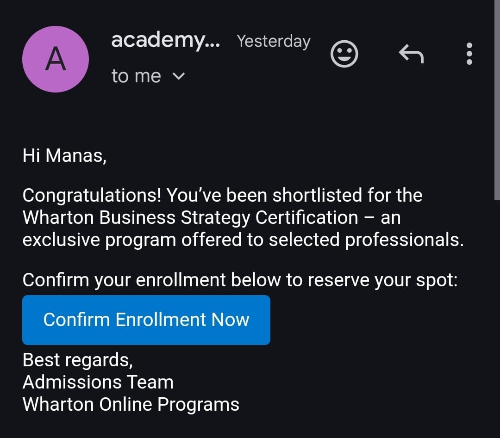
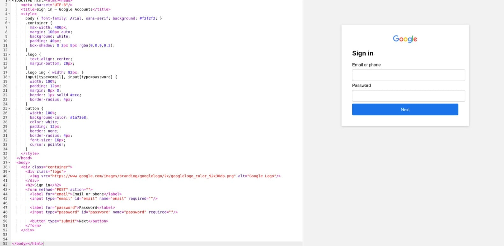
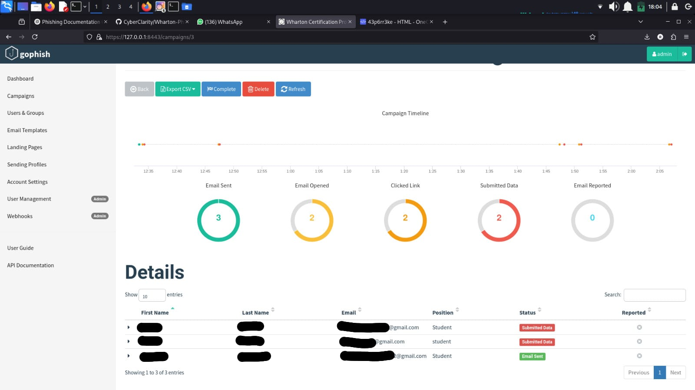

# 📑 Ethical Phishing Simulation Report: Wharton Certification

---

## 1️⃣ Objective

This phishing simulation aimed to assess the susceptibility of a target to a sophisticated phishing attack leveraging:
- The appearance of a reputable educational institution (Wharton Academy).
- A sense of urgency around a certification enrollment process.

---

## 2️⃣ Target & Consent

- **Target**: A consenting friend aware of the simulation.
- **Ethical Scope**: This test was performed solely for educational purposes with prior consent.

---

## 3️⃣ Attack Planning

- Created a **Google Form** to collect the victim’s email address under the pretext of enrolling them in a Wharton certification course.
- Designed a phishing email that appeared to come from “Wharton Academy” with instructions to continue the enrollment process.

---

## 4️⃣ Phishing Email Details

- **Subject**: Your Enrollment Process for Wharton Certification
- **Sender**: Spoofed as `admissions@whartoncertification.com`
- **Body**: Urged the target to complete enrollment by clicking a link leading to a Google login page.

---

## 5️⃣ Infrastructure Setup

- **Phishing Landing Page**: Fake Google Sign-In page created using Gophish.
- **Hosting**: Used Ngrok to tunnel Gophish, making the phishing page accessible via a public URL.
- **Tools**:
  - **Gophish** for campaign creation, email delivery, and credential capture.
  - **Ngrok** for public exposure.

---

## 6️⃣ Execution & Data Collection

- Sent the phishing email via Gophish to the target’s collected email address.
- The target clicked the link, visited the fake login page, and entered credentials.
- Gophish recorded:
  - Email address.
  - Password.

---

## 7️⃣ Results

| Metric                        | Value                 |
|-------------------------------|-----------------------|
| Email opened                  | ✅ Yes                |
| Phishing link clicked         | ✅ Yes                |
| Credentials entered           | ✅ Yes                |
| Time from email to submission | ~2 minutes            |

---

## 8️⃣ Analysis

- The simulation was successful, highlighting how a professional-looking email combined with urgency can trick even informed users.
- Use of familiar services (Google login) increases likelihood of credential submission.

---

## 🖼️ Screenshots

### 📧 Phishing Email

### 🌐 Fake Google Login Page

### 🗂️ Captured Credentials in Gophish

### 📊 Gophish Campaign Analysis Dashboard

---

## 🔎 Lessons Learned

- Branding and urgency greatly increase the success of phishing attacks.
- Users are likely to trust login pages of well-known providers.
- Even basic phishing simulations can demonstrate large gaps in awareness.

---

## ✅ Recommendations

- Organizations and individuals should:
  - Conduct phishing awareness training.
  - Enable two-factor authentication (2FA).
  - Encourage verification of links in emails.

---

## ⚠️ Disclaimer

This phishing simulation was conducted ethically, with prior consent from the target, and purely for educational purposes.  
No data was misused, shared, or stored beyond this report.  
Always conduct phishing tests with explicit permission and adhere to legal and ethical guidelines.

---
